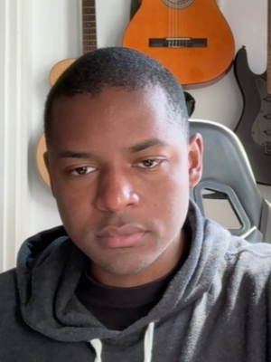

---

#### Software Engineer | Backend Systems, Cloud-Native Applications, and Distributed Architectures

<table>
  <tr>
    <td valign="middle" width="200">
      
    </td>
    <td valign="middle">
      
I am a Software Engineer with a Bachelor's degree in Computer Engineering and an MBA in Software Engineering from FIAP. My work focuses on backend systems, cloud-native applications, and distributed architectures. I am passionate about software engineering and artificial intelligence, and I enjoy building reliable technology that addresses real-world problems and delivers business value.

    </td>
  </tr>
</table>

### Technologies

- **Cloud:** AWS, Google Cloud Platform (GCP)
- **Programming languages:** Java, Go, Rust

### Areas of interest

I am continuously studying software architecture, data structures, and design patterns. I am also interested in building integrations and distributed systems using messaging, webhooks, REST APIs, and cloud technologies.

### A little about me

Outside of work, I enjoy exploring nature, traveling, spending time with friends, and playing the guitar. I have a big heart and believe technology can help make the world a better place. For me, it’s a way to turn my curiosity into something meaningful.

### Connect with me

- [LinkedIn](https://www.linkedin.com/in/leonardofreiitas/)
- [Email](mailto:leonardo.freiitas@outlook.com)
- [Steam](https://steamcommunity.com/id/leonardo3965/)
